# Word of the Day App

A simple React Native app built using **Expo** that displays a "Word of the Day" along with its definition and example sentence. The app also allows users to browse through previously viewed words and persists data between sessions using **AsyncStorage**. Routing is implemented using **Expo Router**.

---

## 📱 Features

- **Home Screen:**
  - Displays a randomly fetched "Word of the Day" with its definition and example sentence.
  - A "New Word" button to fetch and display a new word.
  - A button to navigate to the "History" screen.

- **History Screen:**
  - Displays a list of previously viewed words with their definitions, example sentences, and the date they were first displayed.
  - A "Clear History" button to remove all past words.

- **Data Persistence:**
  - Uses `AsyncStorage` to save and retrieve viewed words between app sessions.

- **Navigation:**
  - Utilizes **Expo Router** for seamless navigation between screens.


## 🚀 Installation and Setup

1. **Clone the Repository:**
   ```bash
   git clone https://github.com/Prathamdas3/word_of_day.git
   ```

2. **Change into folder:**
   ```bash
   cd word_of_day
   ```

3. **Install Dependencies:**
   ```bash
   npm install 
   or
   pnpm install
   or 
   bun install
   ```

4. **Create a clean prebuild:**
   ```bash
   npx expo prebuild --clean
   or 
   bunx expo prebuild --clean
   ```

5. **Start on Emulator:**
   ```bash
   npm run android
   or 
   bun run android
   or 
   pnpm run android
   ```

## 🧑‍💻 Usage Instructions
1. Open the app on your device or emulator.
2. On the Home Screen:
    - View the current "Word of the Day."
    - Press the "New Word" button to fetch a new word.
    - Navigate to the History Screen to view previously viewed words.
3. On the History Screen:
    - Browse the list of past words with their definitions and example sentences.
    - Use the "Clear History" button to remove all stored words.
  
## 🛠️ Technologies Used
1. React Native (via Expo)
2. Expo Router for navigation
3. AsyncStorage for data persistence
4. TypeScript 
5. React Hooks: useState, useEffect, etc.
6. Axios, @tanstack/react-query

## 📸 Sample Screenshots

### Light Theme
<div style="display:grid,grid-cols:3">

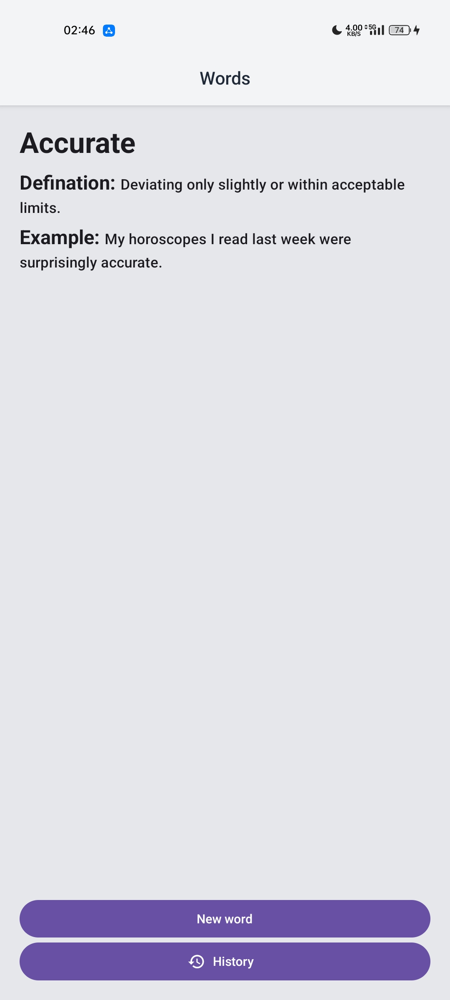

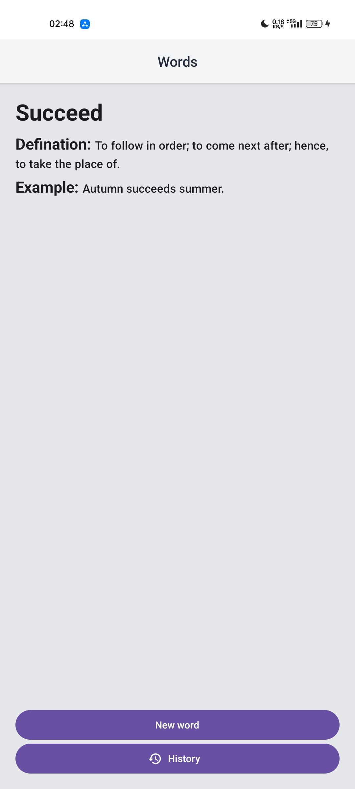
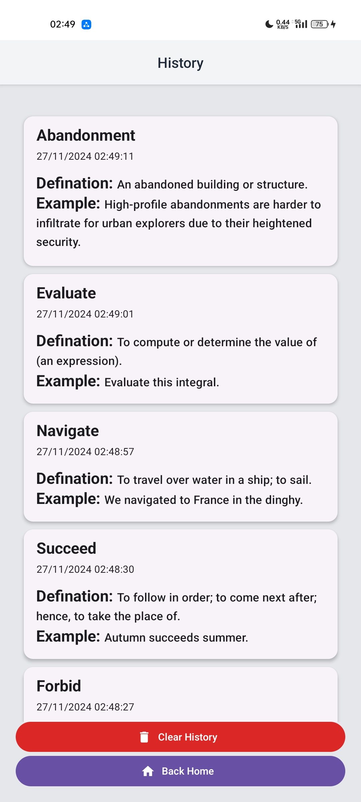
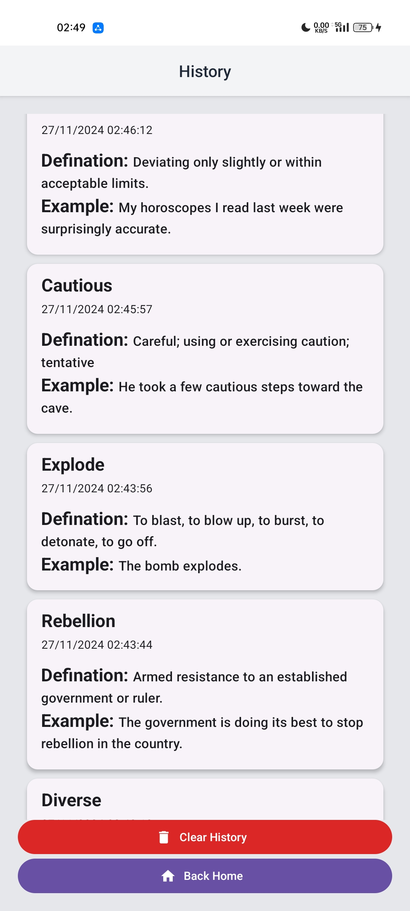
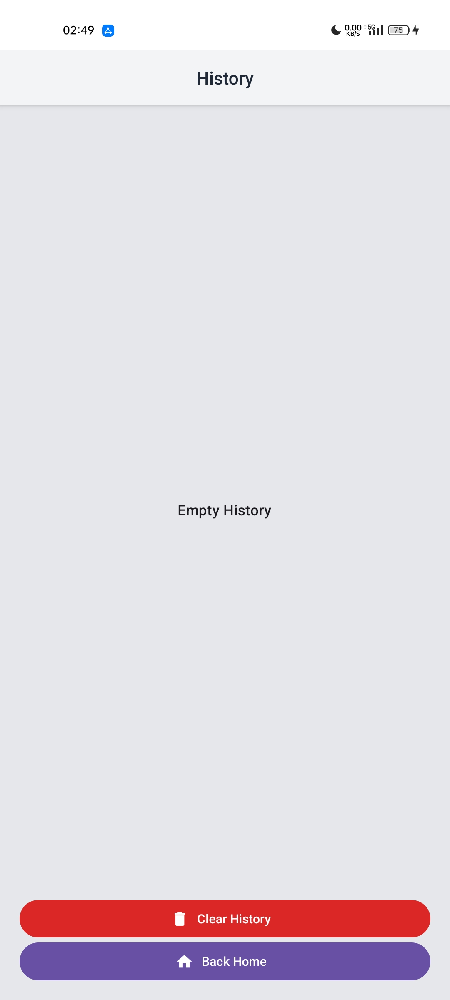
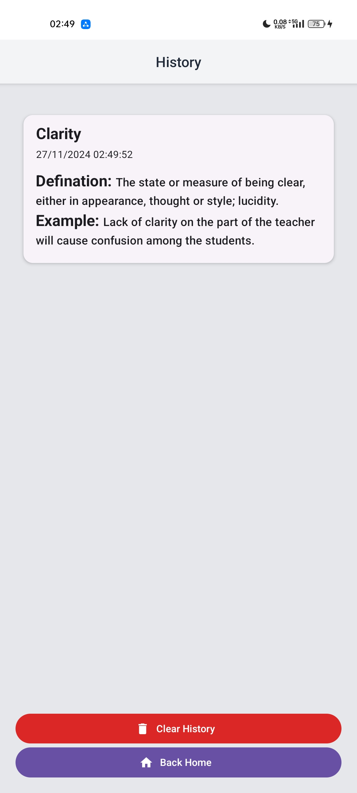
</div>

### Dark Theme

<div style="display:grid,grid-cols:3">
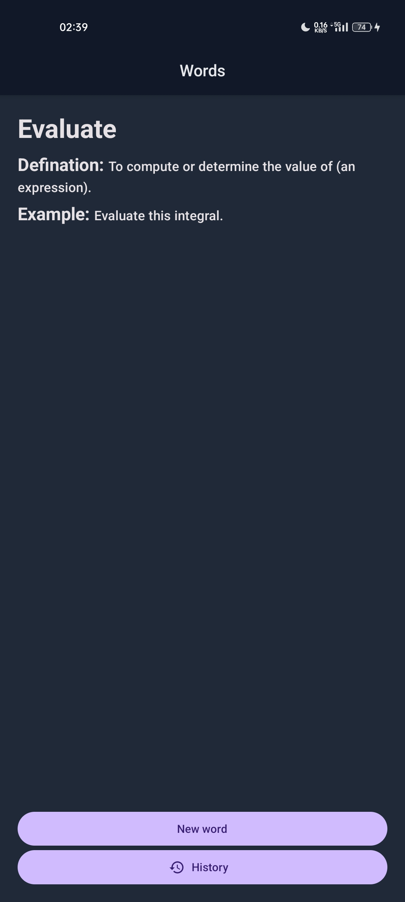
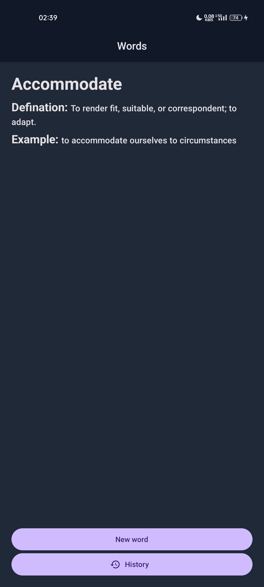
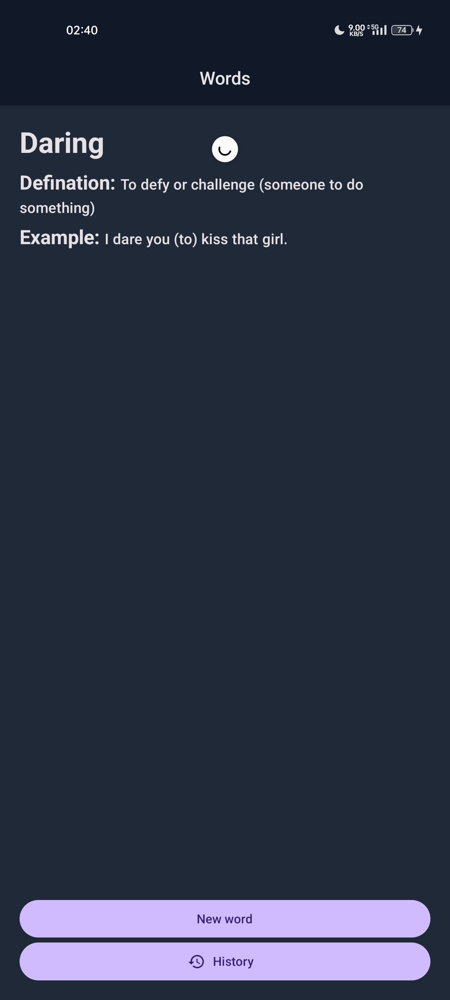
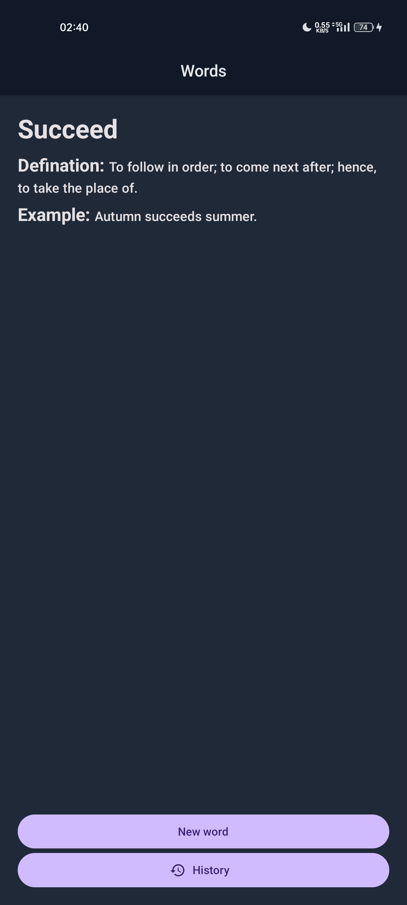
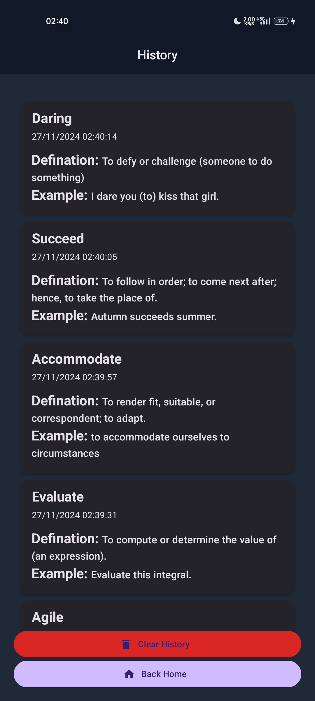
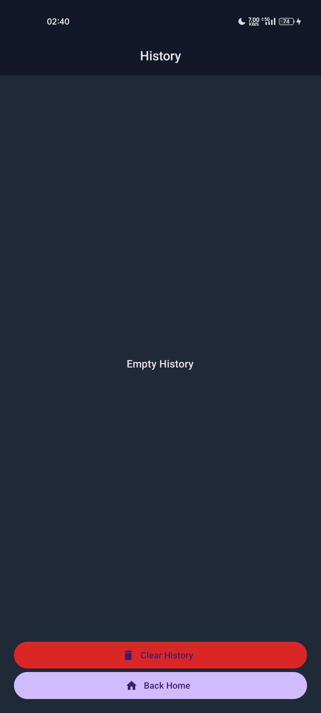
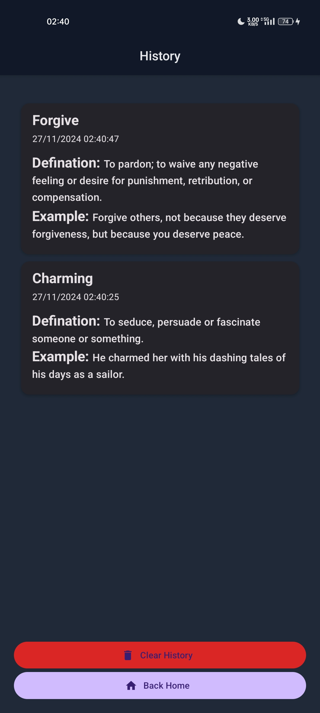
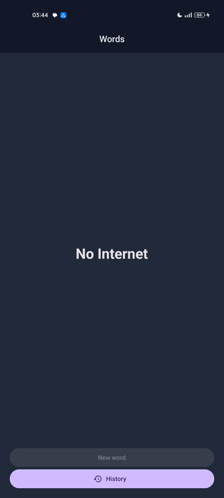
</div>

### Thank you for exploring the Word of the Day App! 🚀